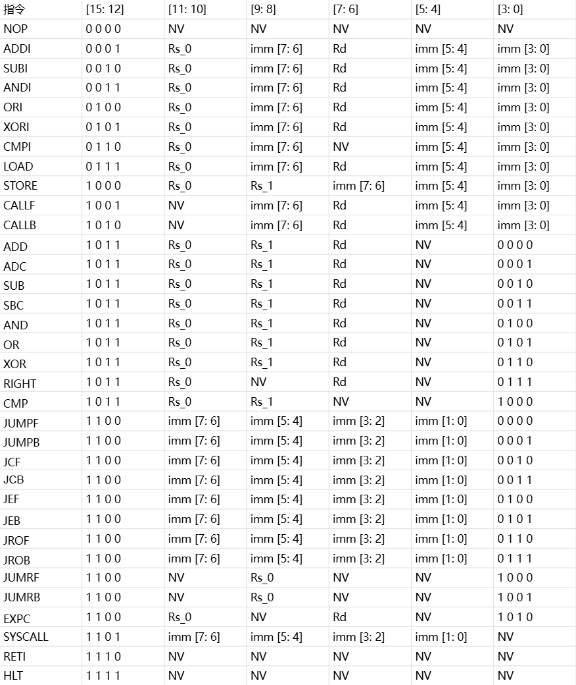

# M8RC
> **一台 8 位 RISC 微型计算机**

---
### 功能概述
- 8 位 RISC 微型计算机
- 使用自研 Tiny16 指令集
- 支持简单中断
- 支持 HLT 休眠
- 支持简单内存管理
- 支持运行简单通用操作系统
- 可用作嵌入式微处理器

---
### 核心参数
| 参数 | 规格 |
|:---|:---|
|数据总线|8 位|
|地址总线|可选|
|寄存器|4 个|
|指令|30+条 16 位定长指令|
|流水线|取指 -> 执行|
|分页|硬件分页|
|栈支持|软件栈|
|中断|单层 边沿触发|
|分支|延迟分支 (延迟槽:1)|
|RAW|前递策略|
|外设|内存映射I/O|
|系统|复用分页及中断逻辑|

---
### 指令集
**NOP
ADDI
SUBI
ANDI
ORI
XORI
CMPI
LOAD
STORE
CALLF
CALLB
ADD
ADC
SUB
SBC
AND
OR
XOR
RIGHT 
CMP
JUMPF
JUMPB
JCF
JCB
JEF
JEB
JROF
JROB
JUMRF
JUMRB
EXPC
SYSCALL
RETI
HLT**

---
## 指令编码
> 如图所示

---
### 项目说明
hardware/CPU.circ : **Logisim-evolution 仿真文件**  
assembler/ : **汇编器代码文件**

---
## License

- Hardware (hardware/, docs/): CERN-OHL-S-2.0
- Software (assembler/): MIT

---
### 下一步
**完成 CPU 仿真验证 && 完成汇编器**